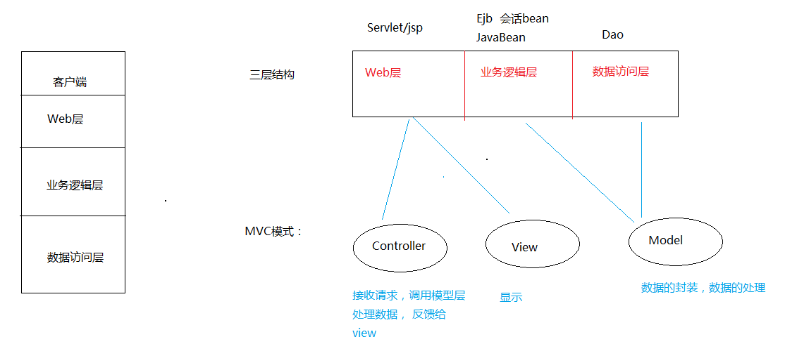

元数据

Meata data 

> 描述数据的数据 String sql , 描述这份sql字符串的数据叫做元数据

数据库元数据  DatabaseMetaData
参数元数据  ParameterMetaData
结果集元数据  ResultSetMetaData

###MVC设计模式

###JSP的开发模式

###三层架构&MVC练习

##学生信息管理系统

## 数据库准备

	CREATE DATABASE stus;
	USE stus;
	CREATE TABLE stu (
		sid INT PRIMARY KEY  AUTO_INCREMENT,
		sname VARCHAR (20),
		gender VARCHAR (5),
		phone VARCHAR (20),
		birthday DATE,
		hobby VARCHAR(50),
		info VARCHAR(200)
	);

##查询

1.    先写一个JSP 页面， 里面放一个超链接 。 

      <a href="StudentListServlet"> 学生列表显示</a>

2.    写Servlet， 接收请求， 去调用 Service  , 由service去调用dao

3.    先写Dao , 做Dao实现。

      	public interface StudentDao {

      ​		
      		/**
      *   查询所有学生
          * @return  List<Student>
             */
            List<Student> findAll()  throws SQLException ;
            }

          ---------------------------------------------

		public class StudentDaoImpl implements StudentDao {

​		
			/**
			 * 查询所有学生
			 * @throws SQLException 
			 */
			@Override
			public List<Student> findAll() throws SQLException {
				QueryRunner runner = new QueryRunner(JDBCUtil02.getDataSource());
				return runner.query("select * from stu", new BeanListHandler<Student>(Student.class));
				}
	
		}	

4. 再Service , 做Service的实现。

		/**
		 * 这是学生的业务处理规范
		 * @author xiaomi
		 *
		 */
		public interface StudentService {
		
			/**
			 * 查询所有学生
			 * @return  List<Student>
			 */
			List<Student> findAll()  throws SQLException ;
		
		}
	
		------------------------------------------
	
		/**
		 * 这是学生业务实现
		 * @author xiaomi
		 *
		 */
		public class StudentServiceImpl implements StudentService{
		
			@Override
			public List<Student> findAll() throws SQLException {
				StudentDao dao = new StudentDaoImpl();
				return dao.findAll();
			}
		}

5. 在servlet 存储数据，并且做出页面响应。

   		protected void doGet(HttpServletRequest request, HttpServletResponse response) throws ServletException, IOException {

   ​		
   		try {
   			//1. 查询出来所有的学生
   			StudentService service = new StudentServiceImpl();
   			List<Student> list = service.findAll();
   			
   			//2. 先把数据存储到作用域中
   			request.setAttribute("list", list);
   			//3. 跳转页面
   			request.getRequestDispatcher("list.jsp").forward(request, response);
   			
   		} catch (SQLException e) {
   			e.printStackTrace();
   		}
   		
   	}

6. 在list.jsp上显示数据

   EL + JSTL  + 表格

##增加 

1. 先跳转到增加的页面 ， 编写增加的页面

2. 点击添加，提交数据到AddServlet . 处理数据。

3. 调用service

4. 调用dao, 完成数据持久化。

5. 完成了这些存储工作后，需要跳转到列表页面。 这里不能直接跳转到列表页面，否则没有什么内容显示。 应该先跳转到查询所有学生信息的那个Servlet， 由那个Servlet再去跳转到列表页面。

6. 爱好的value 值有多个。 

   request.getParameter("hobby");
   String[] hobby = 	request.getParameterValues("hobby") ---> String[] 
   String value = Arrays.toString(hobby): // [爱好， 篮球， 足球]

###删除

1. 点击超链接，弹出一个询问是否删除的对话框，如果点击了确定，那么就真的删除。

		<a href="#" onclick="doDelete(${stu.sid})">删除</a>

​		

1. 让超链接，执行一个js方法

   	

2. 在js访问里面判断点击的选项，然后跳转到servlet。

3. servlet收到了请求，然后去调用service ， service去调用dao

##更新

1. 点击列表上的更新， 先跳转到一个EditServlet 

> 在这个Servlet里面，先根据ID 去查询这个学生的所有信息出来。

2. 跳转到更新的页面。 ，然后在页面上显示数据

		 <tr>
			<td>姓名</td>
			<td><input type="text" name="sname" value="${stu.sname }"></td>
		  </tr>

		   <tr>
			<td>性别</td>
			<td>
				<!-- 如果性别是男的，  可以在男的性别 input标签里面， 出现checked ,
				如果性别是男的，  可以在女的性别 input标签里面，出现checked -->
				<input type="radio" name="gender" value="男" <c:if test="${stu.gender == '男'}">checked</c:if>>男
				<input type="radio" name="gender" value="女" <c:if test="${stu.gender == '女'}">checked</c:if>>女
			</td>
		  </tr>

		 <tr>
			<td>爱好</td>

			<td>
				<!-- 爱好： 篮球 ， 足球 ， 看书 
				因为爱好有很多个，  里面存在包含的关系 -->
				<input type="checkbox" name="hobby" value="游泳" <c:if test="${fn:contains(stu.hobby,'游泳') }">checked</c:if>>游泳
				<input type="checkbox" name="hobby" value="篮球" <c:if test="${fn:contains(stu.hobby,'篮球') }">checked</c:if>>篮球
				<input type="checkbox" name="hobby" value="足球" <c:if test="${fn:contains(stu.hobby,'足球') }">checked</c:if>>足球
				<input type="checkbox" name="hobby" value="看书" <c:if test="${fn:contains(stu.hobby,'看书') }">checked</c:if>>看书
				<input type="checkbox" name="hobby" value="写字" <c:if test="${fn:contains(stu.hobby,'写字') }">checked</c:if>>写字
			
			</td>
		  </tr>

3. 修改完毕后，提交数据到UpdateServlet

> 提交上来的数据是没有带id的，所以我们要手动创建一个隐藏的输入框， 在这里面给定id的值， 以便提交表单，带上id。 

		<form method="post" action="UpdateServlet">
			<input type="hidden" name="sid" value="${stu.sid }">
		
			...
		</form>

4. 获取数据，调用service， 调用dao.

##分页功能

* 物理分页 （真分页）

> 来数据库查询的时候，只查一页的数据就返回了。  

 	优点 内存中的数据量不会太大
	缺点：对数据库的访问频繁了一点。

	SELECT * FROM stu LIMIT	5 OFFSET 2 

* 逻辑分页 （假分页）

> 一口气把所有的数据全部查询出来，然后放置在内存中。 

	优点： 访问速度快。
	缺点： 数据库量过大，内存溢出。

​		